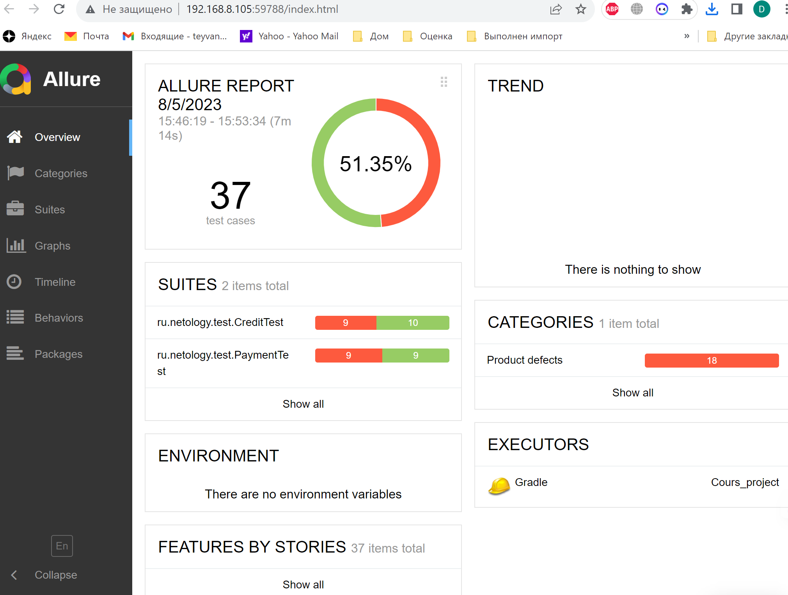
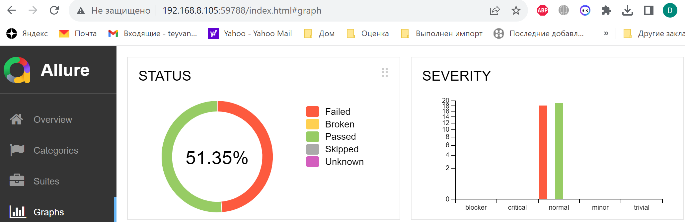

# Отчёт по итогам тестирования
Отчёт по результату автоматизированного тестированию функционала покупки и оформления кредита по данным карты веб-сервиса покупки тура
"Путешествие дня".

### Краткое описание.
Выполнена автоматизация тестирования веб-сервиса "Путешествие дня". В ходе тестирования были проверены:

1) Возможность оплаты двумя способами (покупка по карте и покупка в кредит);
2) Взаимодействие с банковскими сервисами;
3) Взаимодействие с СУБД MySQL;
4) Обработка ответа и демонстрация соответствующих уведомлений;
5) Выдача сообщений об ошибках при неверном заполнении формы.

## Количество тест-кейсов
Всего было проведено 37 автотестов. Общий процент успешных тестов равен 51,35%.
Из них успешных — 19, неуспешных — 18. 

### Результаты тестов по градации серьезности:

### Общие рекомендации.
1) Устранить найденные [ошибки](https://github.com/JanTey/Cours_project/issues)
2) Добавить в код страницы специально подготовленные CSS атрибуты для тестирования (test-id).
3) необходимо качественная техническая документация по проекту.
